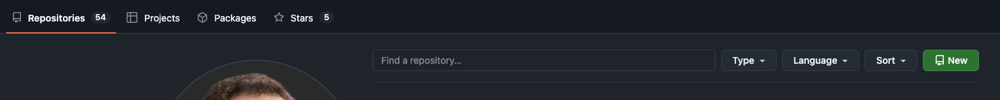
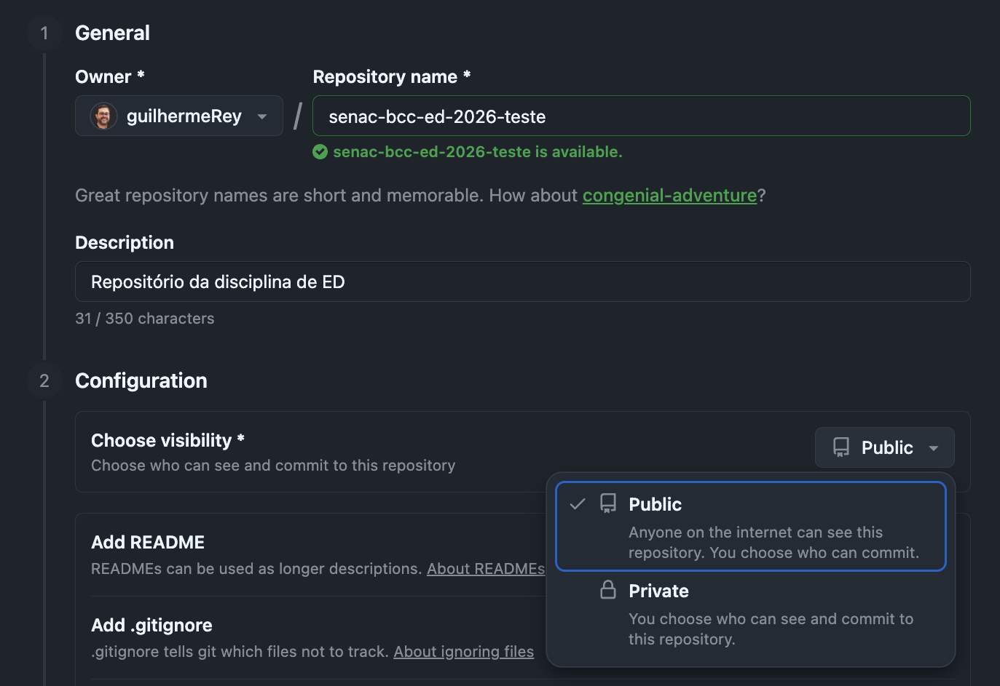
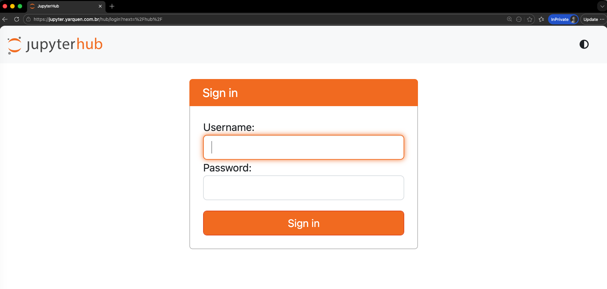
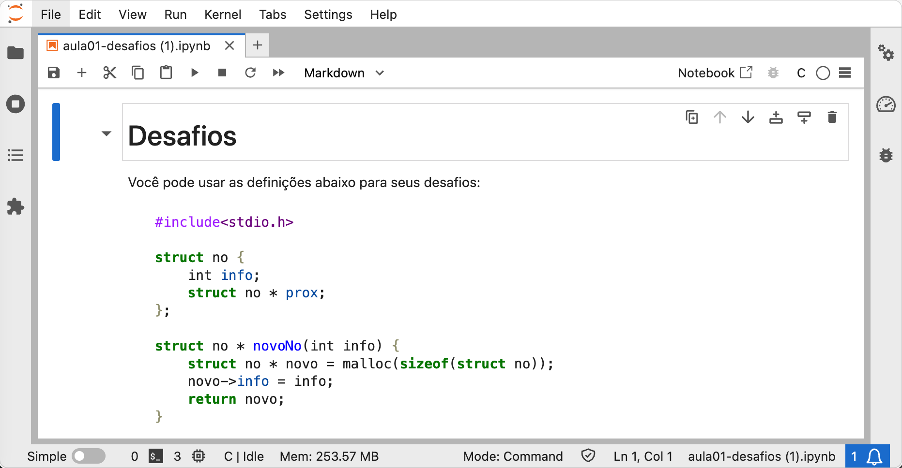
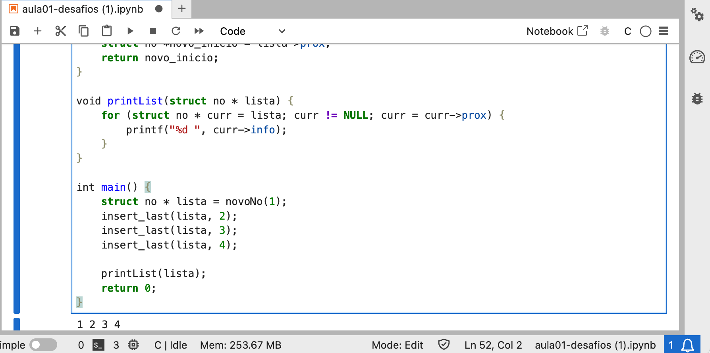
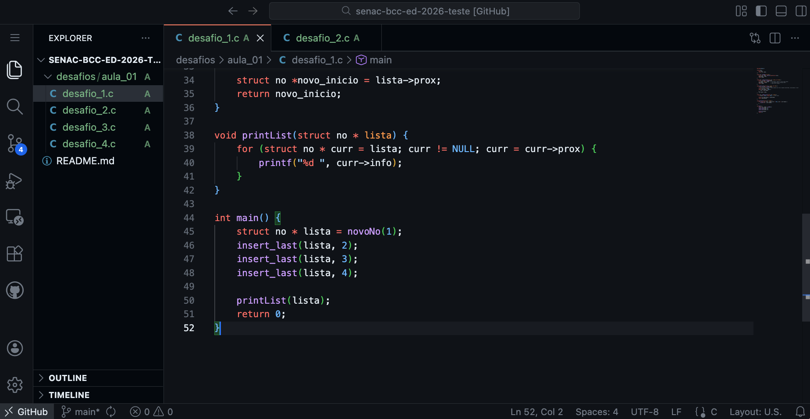
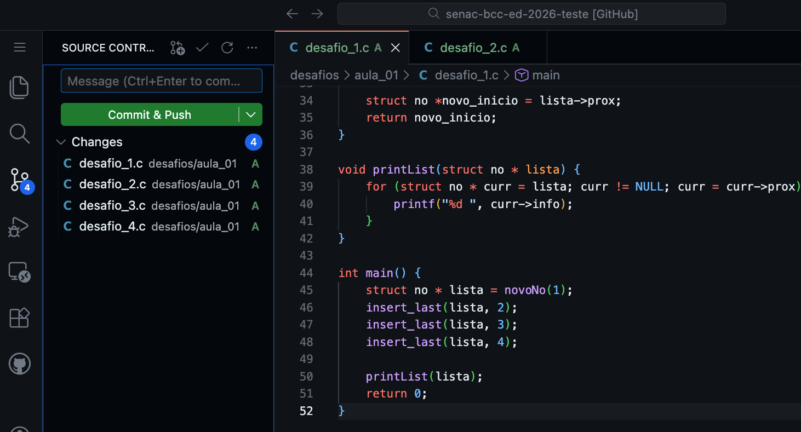
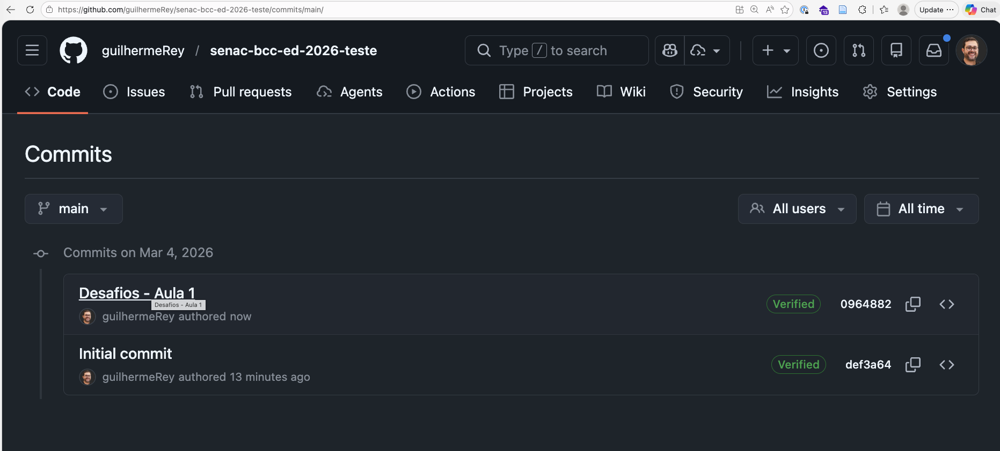
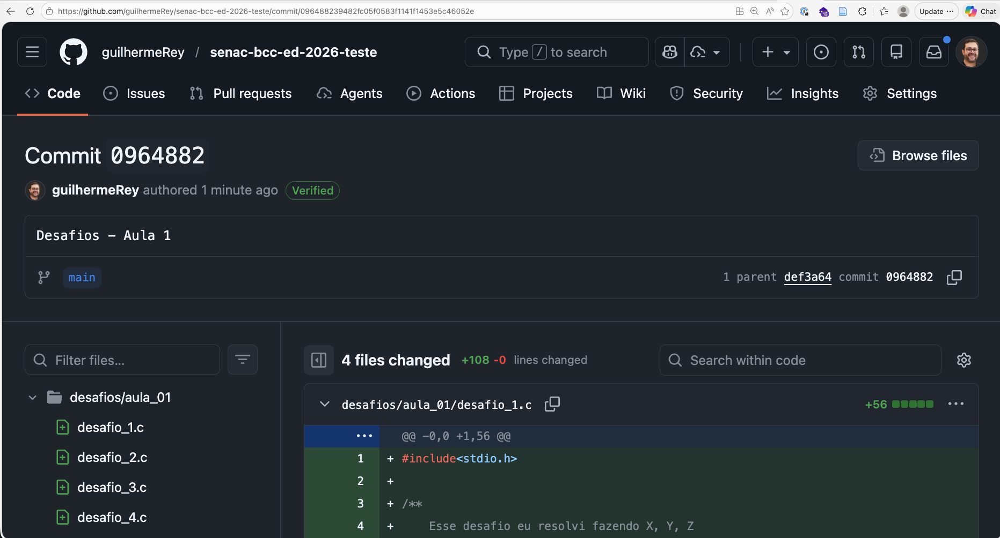

# Estruturas de Dados
### Centro Universitário Senac - Bacharelado em Ciência da Computação

| Prof. Guilherme Rey

Você encontrará os conteúdos de aulas na pasta `/conteúdos` e os desafios a serem feitos na pasta `/desafios`.

## Instruções

Para esta disciplina, você deverá criar um repositório público na sua conta do github. A cada aula, poderá verificar os exercícios e desafios propostos para praticar. 

Você deverá resolvê-los e realizar um `commit` no seu repositório, com a explicação do que foi feito na descrição. 

Depois, com o link do `commit`, fará a submissão no formulário disponível no blackboard.

## Passo a passo

### 1. Crie um repositório público no seu Github

Clique no botão "New":

O repositório tem que ser público!

### 2. Resolva os desafios

Caso você queira, pode utilizar a URL jupyter.yarquen.com.br, acessando com seu RA e uma senha que desejar (ela é criada no primeiro acesso).

Dessa maneira, você pode fazer o download dos arquivos .ipynb deste repositório e adicionar ao seu espaço no Jupyter.

Você precisa sempre colocar todo o código na célula de código do notebook para poder rodá-lo:

### 3. Enviando a solução

Para padronizar o envio, vamos criar uma pasta no seu repositório público e adicionar arquivos em extensão `.c`.

Um maneira simples de fazer isso é entrando no seu repositório e apertando a tecla `.`. Assim, o VSCode vai aparecer no seu navegador! 🥳

Desenvolva as soluções dos desafios para inserir nos arquivos `.c` do seu repositório. Para cada arquivo `.c` com a solução, adicione comentários com a explicação do seu raciocínio. Isso ajuda a você estudar e entender melhor o conceito.

Agora, padronize o envio usando a pasta `desafios` e `aula_0X` para ter os desafios:

Depois de ter colocado todos os desafios, faça um `commit` e `push` na sua branch principal:

### 4. Pegando a URL de commit

Uma vez que você tenha feito o `commit` e `push` das soluções, é possível entrar na área de `commits` do repositório e clicar no `commit` específico:

Ao clicar no `commit`, pegue a URL (essa URL tem o formato parecido com `https://github.com/guilhermeRey/senac-bcc-ed-2026-teste/commit/096488239482fc05f0583f1141f1453e5c46052e`).

### 5. Envie essa URL no formulário

Acesse o formulário que está disponível pelo Blackboard e envie a URL de commit com a data da aula do desafio proposto.

Pronto!