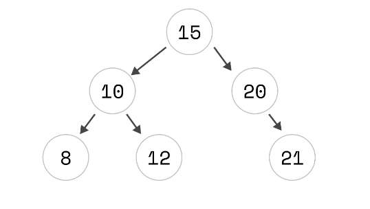

# Árvores Binárias de Busca - 2

Considerando que você implementou os métodos `Insert` e `Search` na sua `BST`, vamos implementar mais dois métodos.

## Desafio

Seu desafio é implementar mais dois métodos na sua `BST`:
- `Node Maximo()`: retorna o maior valor da árvore (faça recursivo e iterativo)
- `Node Minimo()`: retorna o menor valor da árvore (faça recursivo e iterativo)
- `void PrintInOrder()`: imprime os valores da árvore em ordem (faça recursivo e iterativo)

Além disso, tente implementar um método para imprimir os valores de uma maneira boa para visualização no console.

Ou seja, com tudo isso funcionando, um programa assim deve funcionar:

```csharp
public class Program {
    public static void Main(string[] args) {
        BST bst = new BST();
        
        bst.Insert(15);
        bst.Insert(10);
        bst.Insert(8);
        bst.Insert(12);
        bst.Insert(20);
        bst.Insert(21);
        
        Console.WriteLine("In-order traversal (Sorted keys):");
        bst.PrintInOrder();
        Console.WriteLine("Visualização mais legal:");
        bst.CoolPrint();
    }
}
```

Essa seria a árvore:



E o resultado do método `CoolPrint()`:

```
15
    10
        8
        12
    20
        21
```